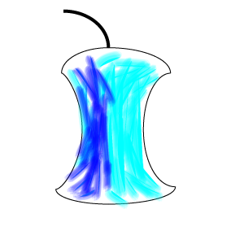

README.md |
|:---|

A class library for .NET applications on desktop, iOS, Android and web

 

OSE Core is a set of libraries that implement low level functionsality for .NET applications
on all platforms including desktop, mobile (iOS and Android) and web.

The functions are divided among the following catagories: i/o, logging, object, text and types

---

_Copyright &copy; 2017-2020 Open Shared Earth, LLC - Provided under the [MIT](LICENSE)._
