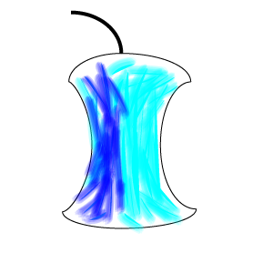

## OSE CORE Libraries

OSE Core is a set of libraries that implement low level functionsality for .NET applications
on all platforms including desktop, mobile (iOS and Android) and web.

The functionality is divided among the following catagories: i/o, logging, object, text and types
