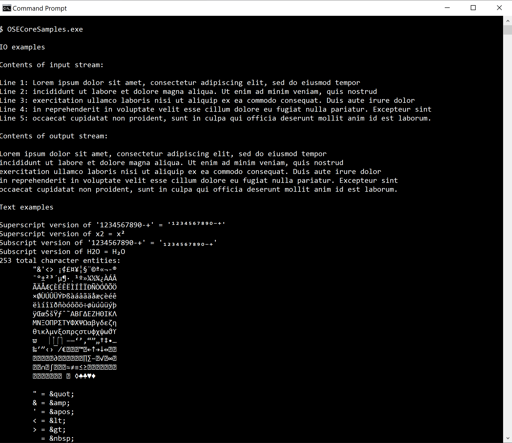
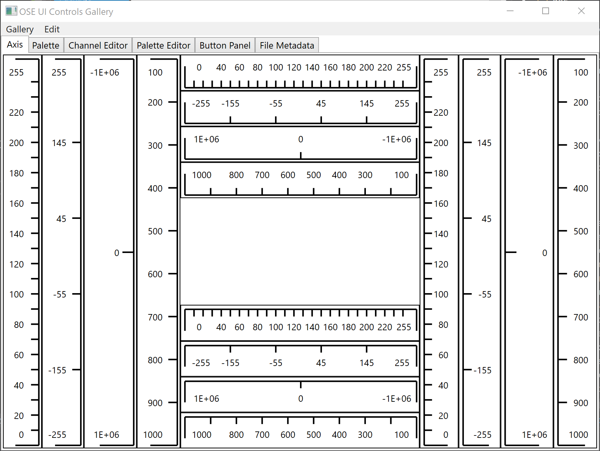
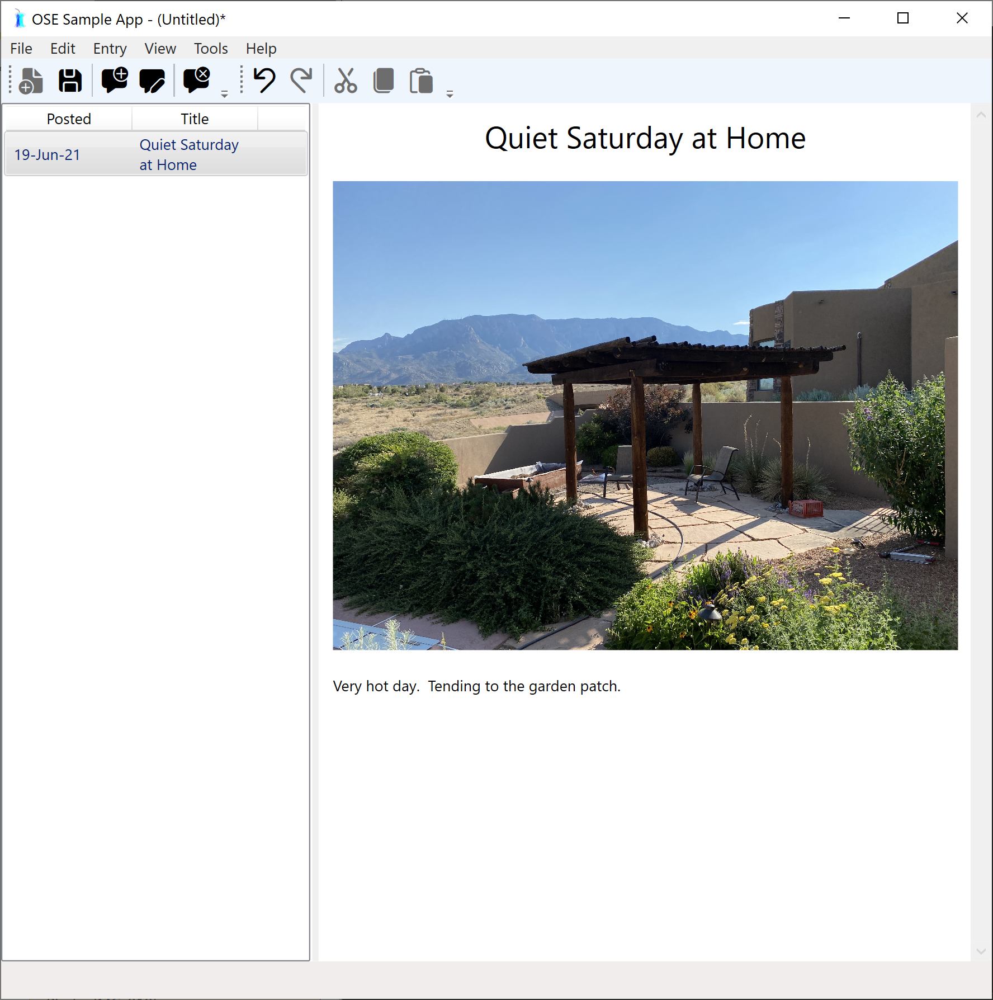

# OSE Samples

The OSE samples demonstrate how OSE classes are used.

# OSECoreSamples console program

This sample program shows how classes in each of the IO, Logging and Text facilities are used.

# OSEUIControls.WPF.Gallery

This sample WPF program demonstrates the WPF controls: Axis, Color Palette, Color Channel Editor, Palette Editor,
File Metadata

# OSEUIDesktop.WPF.Sample

This sample WPF program demonstrates the various desktop program classes by implementing a personal
journal.

